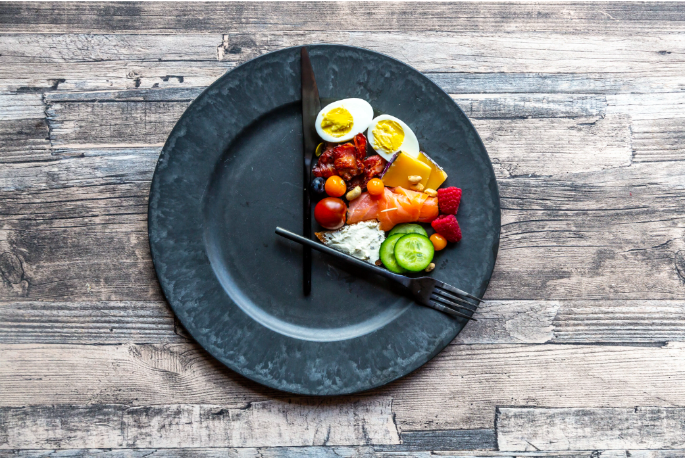

# Projektidee  
## Ausgangslage:  
Ich ernähre mich seit einiger Zeit nach dem "Intermittent Fasting" Konzept. Dabei handelt es sich um eine Ernährungs- bzw. Diät-Form, bei der je nach Plan eine gewisse Zeit lang gefastet wird. Eine der geläufigsten Methoden ist folgende.  
*The 5/2 Diet*: Zwei Tage pro Woche wird gefastet, an den anderen Tagen darf normal gegessen werden. Während den Fasten-Tagen sind bei Männern 600 kcal erlaubt, bei Frauen 500 kcal.  
    
  Quelle: https://www.cnet.com/how-to/intermittent-fasting-extended-fasts-and-more-how-to-safely-follow-a-fasting-diet/
  
## Funktion/Projektidee:  
Diese Applikation soll einen bei dieser Ernährungsform untersützen, um die Kalorieneinnahme besser im Blick zuhaben.  
Eine Datenbank anzulegen, bei der die ganzen Kcal-Angaben aller Lebensmittel aufgeführt sind, würde den Ramen dieses Projektes sprengen. Deshalb wird es die Möglichkeit geben, aus vordefinierten und empfohlenen Rezepten auswählen können bzw. auch eigene Rezepte hinzuzufügen. Da die Kalorienangaben der Rezepte abgespeichert sind, werden diese beim Hinzufügen zum aktuellen Fastentag der aktuellen Kalorienbilanz hinzugerechnet. Ebenfalls gibt es aber auch einige wenige Lebensmittel die hinzugefügt werden können (Früchte, Getränkte etc.).  
Mit dieser Applikation wird es also einfach, auf einen Blick zu sehen, wieviel man heute noch essen darf, um die 500 bzw. 600 kcal nicht zu übersteigen.
  
## Workflow:  
**Dateieingabe:**
* Es können Rezepte oder einzelne wenige Lebensmittel ausgewählt werden, um diese dem aktuellen Fastentag hinzuzufügen.
* eigenes Rezept inkl. Kalorien-Anzahl hinzufügen
* Auswahl, ob die Rezepte zur einfacheren Zubereitung ausgedruckt werden sollen
* Lieblingsrezepte markieren
    
**Datenverarbeitung/Speicherung:**
* kcal der Rezepte zusammenrechnen, die zu den Fastentagen hinzugefügt worden sind
* Summe formatiert anzeigen
* neues Rezept abspeichern und formatieren
  
**Datenausgabe:**
* Kalorienbilanz anzeigen
* Rezepte ausdrucken
* Liste der Lieblingsrezepte anzeigen

